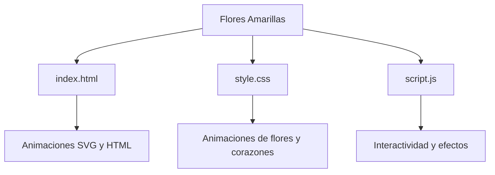

# 🌻 Flores Amarillas
Un jardín digital animado para alegrar el día

## 📖 Descripción General

¿Alguna vez has querido regalar flores que nunca se marchiten? 🌼 Este proyecto es una experiencia visual interactiva que simula un campo de flores amarillas animadas, pensado para sorprender y alegrar a esa persona especial. Utilizando solo tecnologías web modernas, "Flores Amarillas" crea un ambiente mágico donde las flores crecen, se mueven suavemente y los corazones flotan en el aire, transmitiendo alegría y cariño.

El objetivo principal es ofrecer un detalle digital creativo, ideal para celebraciones, aniversarios, o simplemente para decir "te quiero" de una forma original. Los usuarios pueden disfrutar de una animación envolvente, sin necesidad de instalaciones ni configuraciones complicadas.

✨ **Beneficios**:
- Experiencia visual atractiva y relajante.
- Accesible desde cualquier navegador moderno.
- Perfecto para compartir emociones y buenos deseos de manera virtual.

## 🏗️ Arquitectura del Proyecto

El proyecto está organizado de manera sencilla y eficiente para facilitar su comprensión y personalización. Todos los archivos necesarios se encuentran en la misma carpeta, permitiendo una fácil edición y despliegue.

- `index.html`: Estructura principal de la página y elementos animados.
- `style.css`: Estilos y animaciones CSS avanzadas para flores, corazones y fondo.
- `script.js`: Lógica adicional para efectos interactivos (si aplica).

### Diagrama de la estructura (Mermaid)

