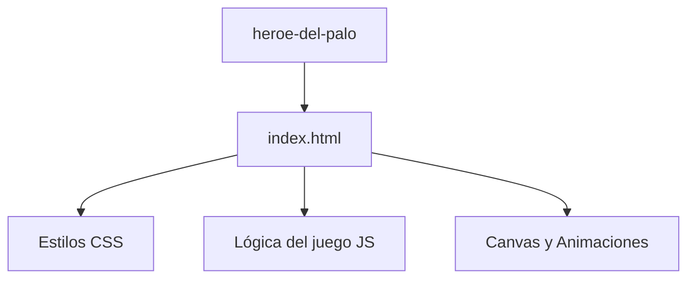

# 📌 Héroe del Palo
¡Pon a prueba tu precisión y reflejos en este desafiante juego casual! 🦸‍♂️🌉

## 📖 Descripción General

**Héroe del Palo** es un juego web interactivo donde tu misión es ayudar a un pequeño héroe a cruzar de plataforma en plataforma usando palos extensibles. El reto consiste en calcular la longitud exacta del palo para no caer al vacío ni pasarte de largo. Este proyecto busca ofrecer una experiencia divertida y adictiva, ideal para quienes disfrutan de los desafíos de habilidad y precisión.
El juego destaca por su diseño minimalista, animaciones suaves y una jugabilidad intuitiva: solo necesitas mantener presionado para estirar el palo y soltar para dejarlo caer.
🎯 **Objetivo:** ¡Llega lo más lejos posible y supera tu propia puntuación!
✨ **Beneficios:**
- Mejora la coordinación y el cálculo visual.
- Perfecto para pasar el rato y competir con amigos.
- Sin instalaciones ni registros: juega directo desde tu navegador.

## 🚀 Tecnologías Usadas

- HTML5
- CSS3
- JavaScript (Vanilla)

## ⚙️ Instalación

Sigue estos pasos para jugar en tu computadora:

```sh
# 1. Clona o descarga este repositorio
git clone https://github.com/GustavoQuinteroC/proyectos.git

# 2. Accede a la carpeta del proyecto
cd proyectos/heroe-del-palo

# 3. Abre el archivo index.html en tu navegador favorito
# Puedes hacer doble clic en index.html o usar un servidor local:
npx serve .
```

¡Listo! El juego se abrirá y podrás empezar a jugar de inmediato.

## 🏗️ Arquitectura del Proyecto

El proyecto está organizado de forma simple para facilitar su comprensión y modificación. Todos los archivos necesarios se encuentran en la misma carpeta.

```plaintext
heroe-del-palo/
│
├── index.html   # Código fuente principal (HTML, CSS y JS integrados)
```

### Diagrama de la estructura (Mermaid)



---

> Hecho con 💡 y pasión por los juegos casuales. ¡Disfruta y comparte!