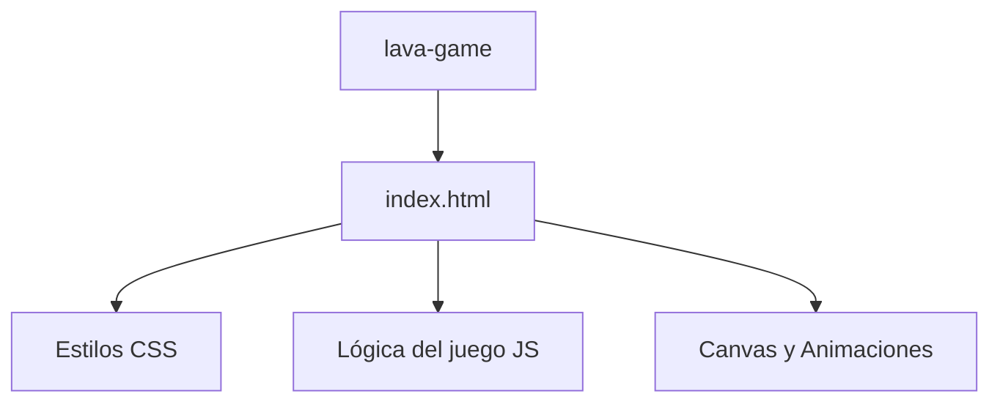

# 🌋 Lava Game
¡Pon a prueba tus reflejos en un mundo de plataformas ardientes!

## 📖 Descripción General

**Lava Game** es un juego de plataformas clásico donde el objetivo es guiar a tu personaje a través de niveles llenos de peligros, principalmente lava y obstáculos mortales. Inspirado en los juegos retro, este proyecto busca ofrecer una experiencia desafiante y divertida, ideal para quienes disfrutan de los retos de precisión y velocidad.
El jugador debe recoger todas las monedas 💰 para ganar cada nivel, evitando caer en la lava 🔥 o chocar contra muros. Cada partida es una oportunidad para mejorar tus habilidades y superar tus propios récords.
Este juego es perfecto para pasar el rato, competir con amigos o aprender sobre desarrollo de videojuegos en JavaScript. ¡Atrévete a sobrevivir en el suelo es lava! 🕹️

## 🚀 Tecnologías Usadas

- HTML5
- CSS3
- JavaScript (Vanilla)

## ⚙️ Instalación

Sigue estos pasos para jugar en tu computadora:

```sh
# 1. Clona o descarga este repositorio
git clone https://github.com/GustavoQuinteroC/proyectos.git

# 2. Accede a la carpeta del juego
cd proyectos/lava-game

# 3. Abre el archivo index.html en tu navegador favorito
# Puedes hacer doble clic en index.html o usar un servidor local:
npx serve .
```

¡Listo! El juego se abrirá y podrás empezar a jugar de inmediato.

## 🏗️ Arquitectura del Proyecto

El proyecto está organizado de forma simple para facilitar su comprensión y modificación. Todos los archivos necesarios se encuentran en la misma carpeta.

```plaintext
lava-game/
│
└── index.html   # Código fuente principal (HTML, CSS y JS integrados)
```

### Diagrama de la estructura (Mermaid)



---

> Hecho con 💡 y pasión por los juegos casuales. ¡Disfruta y comparte!